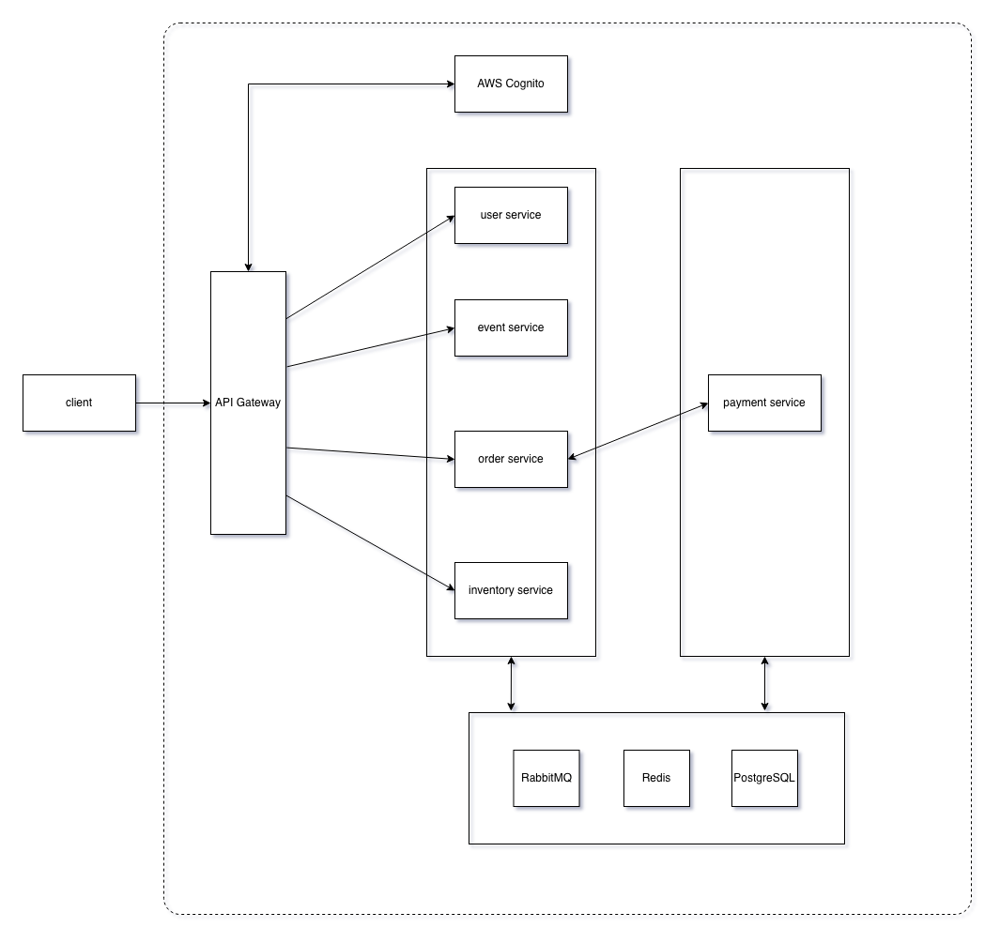

# Distributed Ticketing System

A microservices-based event ticketing system built with Spring Boot.

## Overview

<!-- TODO: 1-2 paragraphs on what the app does, target users, and the headline use cases (browse events, hold seats, pay, confirm). -->

## Architecture

### Services

| Service     | Port | Responsibility                                               |
|-------------|------|--------------------------------------------------------------|
| `event`     | 8080 | Event catalog: events, artists, venues, categories           |
| `inventory` | 8081 | Seat holds and deductions                                    |
| `order`     | 8082 | Order lifecycle, payment orchestration, SSE status streaming |
| `payment`   | 8083 | Stripe integration, PaymentIntent lifecycle                  |
| `user`      | 8084 | User profile                                                 |

`user`, `order`, `inventory`, and `payment` are client-facing microservices exposed via the API Gateway, and `payment` is the only one that is used internally.
The services communicate using HTTP for synchronous communication and messaging via RabbitMQ for asynchronous communication. The microservices aim for eventual consistency and implement the SAGA pattern, specifically, choreography, to coordinate distributed transactions.

### Architecture diagram


## Tech stack

- **Java, Spring Boot** - microservice development
- **PostgreSQL** - data persistence
- **Redis** - hot state and cache
- **RabbitMQ** - asynchronous messaging
- **Docker** - containerization and deployment
- **Kubernetes** - container orchestration
- **AWS (API Gateway, Cognito)**
- **Stripe** - payment processing
- **Swagger/OpenAPI** - API documentation
- **Resend** - emailing

## Running locally

### Prerequisites

- Docker + Docker Compose
- JDK 17 (only if you want to run a service outside Docker)
- A Stripe test account 
- A Resend API key (optional; required for email)

### Environment

Copy the example file and fill in secrets:

```bash
cp .env.example .env
```

Required variables:  
`DB_HOST`  
`DB_PORT`  
`DB_USERNAME`  
`DB_PASSWORD`  
`RABBITMQ_HOST`  
`RABBITMQ_PORT`  
`RABBITMQ_USERNAME`  
`RABBITMQ_PASSWORD`  
`REDIS_HOST`  
`REDIS_PORT`  
`RESEND_API_KEY`  
`RESEND_FROM`  
`STRIPE_API_KEY`  
`STRIPE_WEBHOOK_SECRET`   

### Start everything

```bash
docker compose up --build
```

Services come up at:

- Event:     http://localhost:8080
- Inventory: http://localhost:8081
- Order:     http://localhost:8082
- Payment:   http://localhost:8083
- User:      http://localhost:8084
- RabbitMQ management UI: http://localhost:15672
